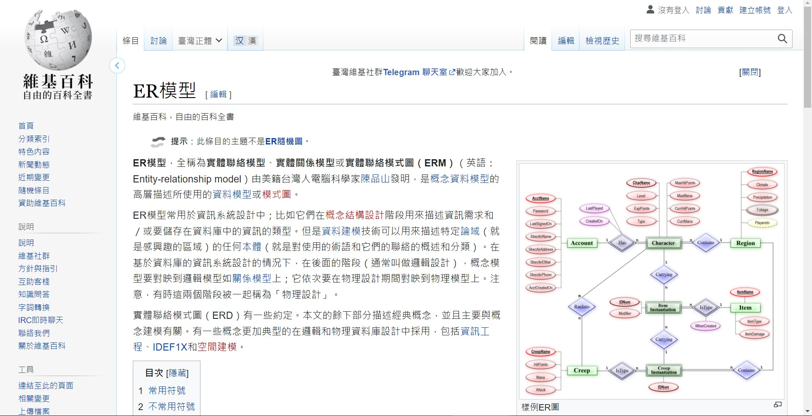
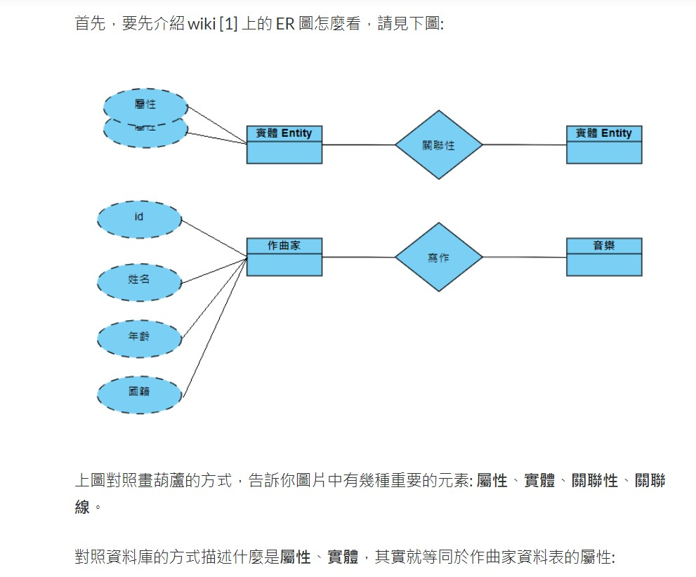
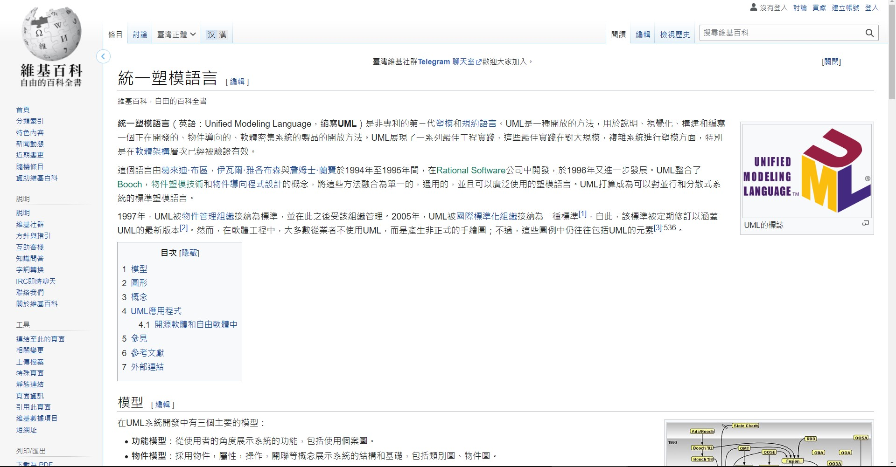

# 1.實體關聯性模型圖 ER/EER Diagram
[後端工程師與圖的修練 系列](https://ithelp.ithome.com.tw/users/20092753/ironman/39160)

[Day 24 -資料庫應用小程式 資料庫設計(實體關聯模型(E-R model)分析)](https://ithelp.ithome.com.tw/articles/10279385)

[實體關聯性模型圖 ER/EER Diagram](https://ithelp.ithome.com.tw/articles/10270611)

[實體關聯模型(E-R model)分析](https://database.klab.tw/lesson-4-2/)

1.1 資料表的關聯性 : Has a , Contains
- 1 對 1 (1-1)
- 多對 1 (1-many, many-1)
- 多對多 (many-to-many)

多對多的關聯必須有一個表(ex.C)C專門來記錄A.B表的關聯

#2 UML 統一塑模語言

[IT鐵人DAY 6－UML基本認識](https://ithelp.ithome.com.tw/articles/10269210)

