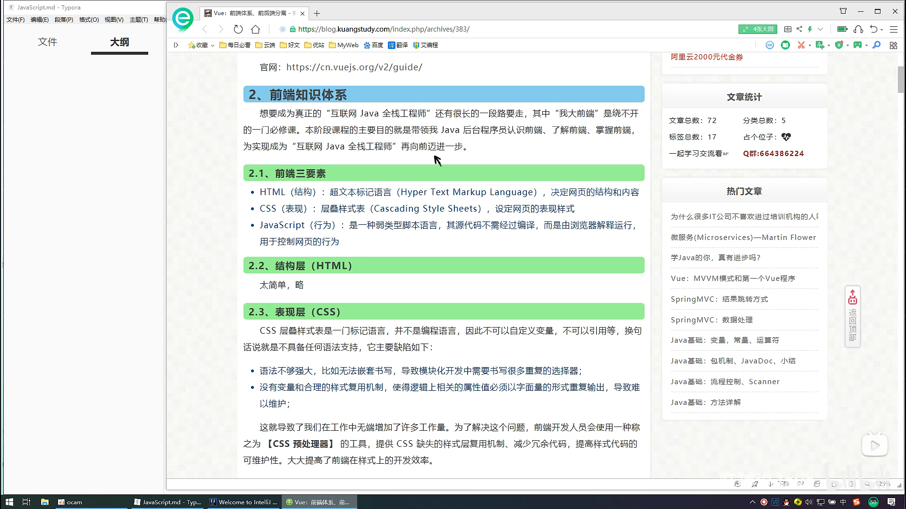
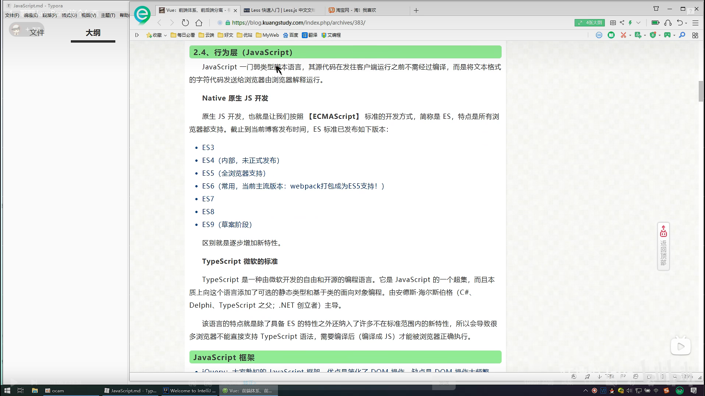
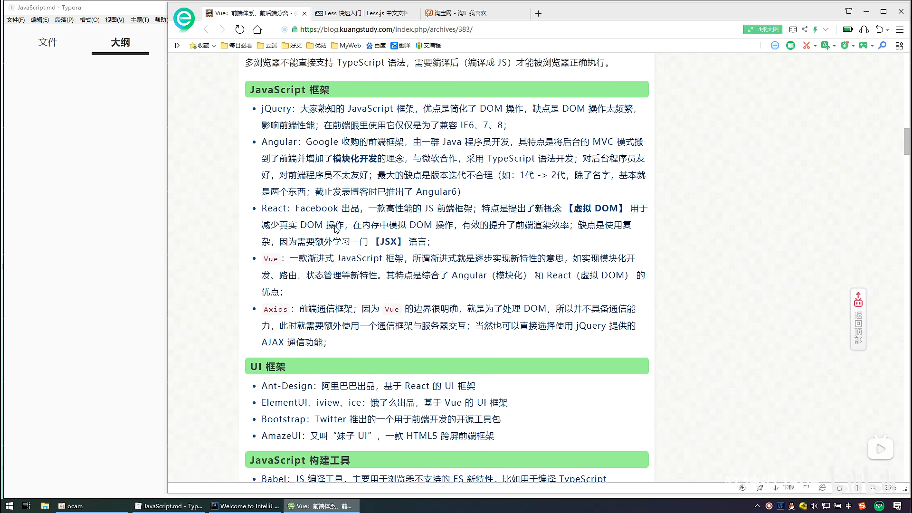
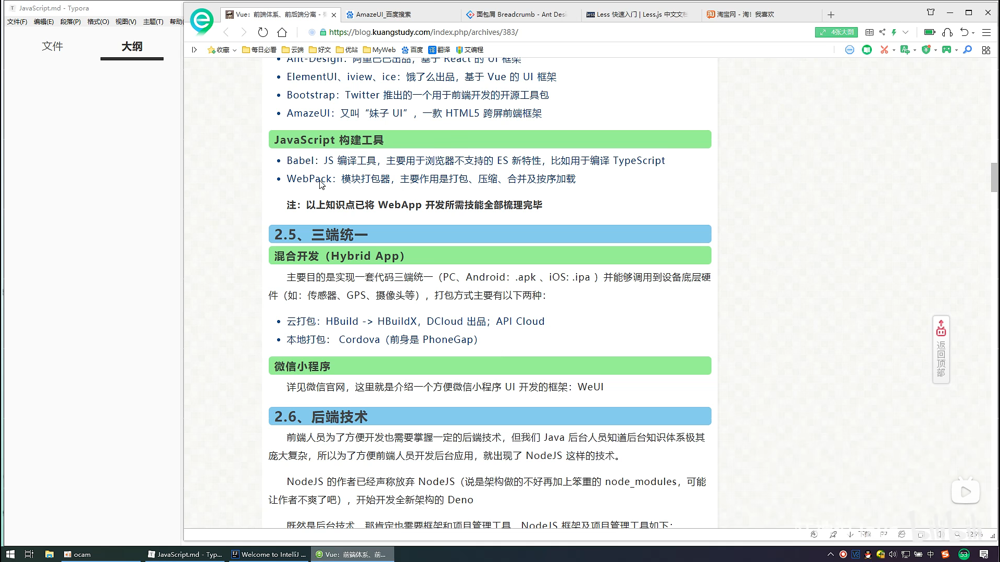
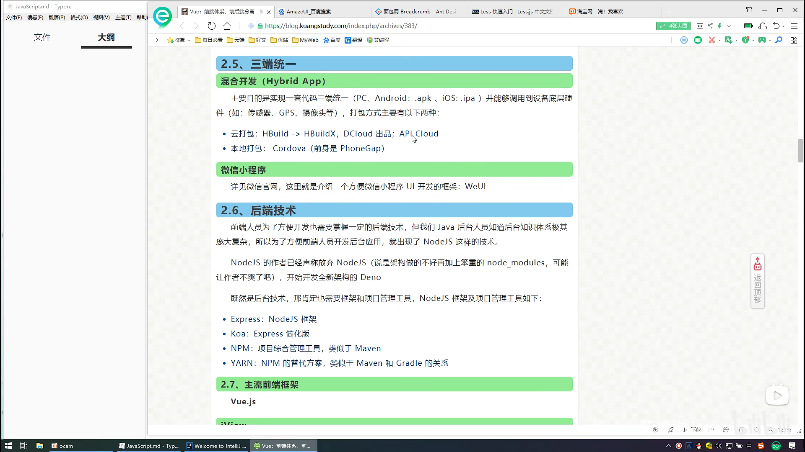
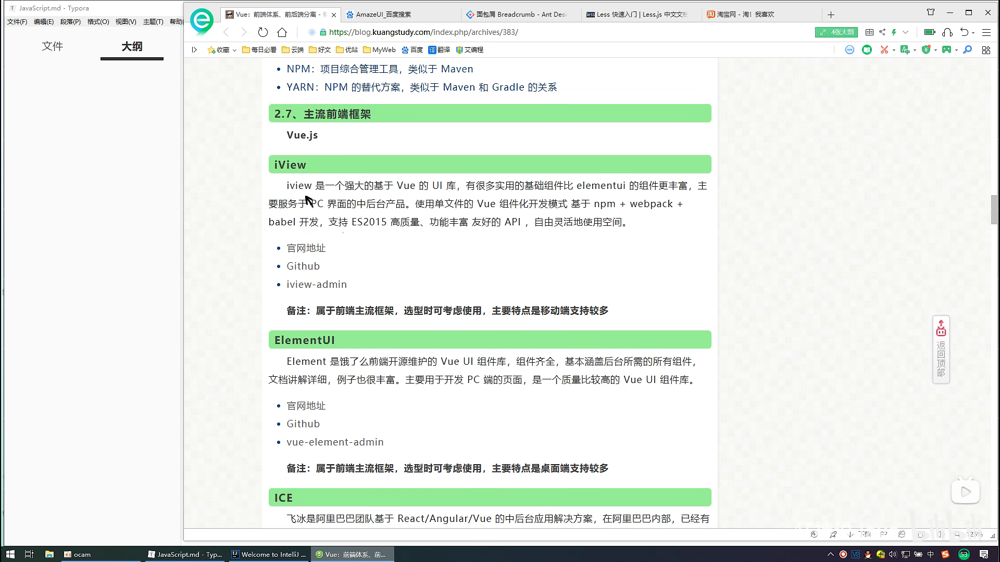
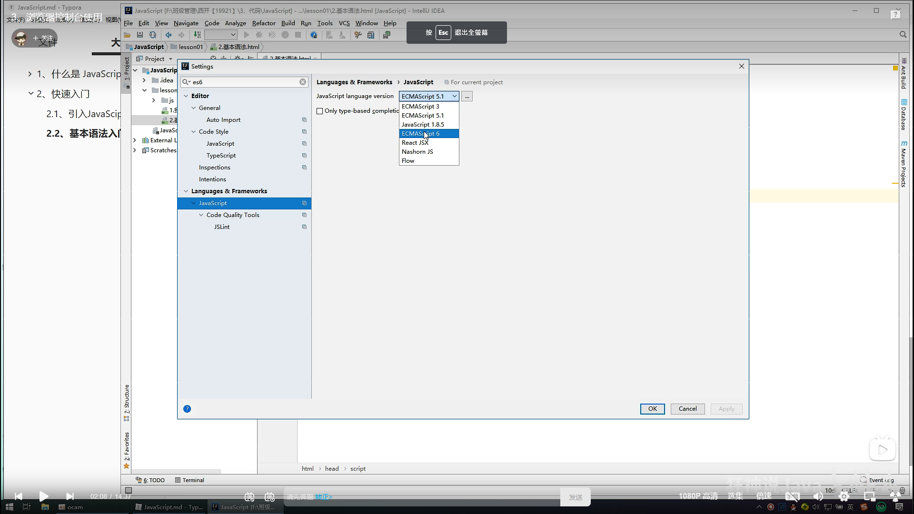
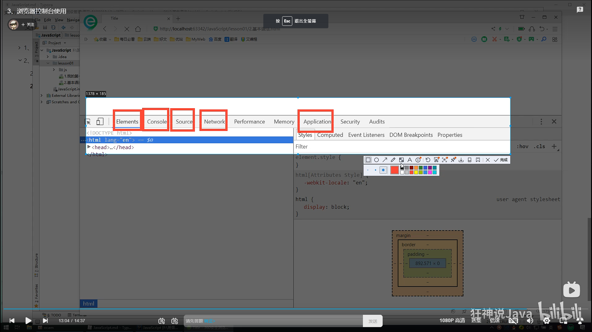

# 【狂神说Java】JavaScript最新教程通俗易懂

# Intro to Javascript








1.什麼是Javascript
Javascript是世界上最流行的腳本語言

__一個合格的後端人員，必須精通Javascript__

## ecmascript

ecmascript可以理解為是Javascript的一個標準
最新版本已經到es6版本
但是大部分瀏覽器還只停留在支持es5代碼上
開發環境---線上環境，版本不一致

關鍵字，變量.流程控制.對象.數組.結構

# 快速入門

## 引入JavaScript

內部標籤
```html
    <!--script標籤內，寫Javascript代碼-->
    <!--    <script>-->
    <!--        alert('hello,world');-->
    <!--    </script>-->
```

外部引入
test.html
```html
    <!--    外部引入-->
    <!--    注意:script，必須成對出現-->
    <script src="./js/1.js"></script>
```

1.js
```javascript
alert('hello,world');
```

# 基本語法入門

intellij改成支持es6


瀏覽器developer tool 常用功能


# 數據類型

數值，文本，圖形，音頻，視頻...

__number__

js不區分小數和整數

```javascript
123  //整數123
123.1 //浮點數123.1
1.123e3 //科學計數法
-99//負數
Nan  //not a number
Infinity //無窮大

```

__字符串__
'abc'

"abc"

__布爾值__
true
false

__邏輯運算__
```javascript
&& 兩者都為真，結果為真

|| 一個為真，結果為真

! 真即假，假即真
```


