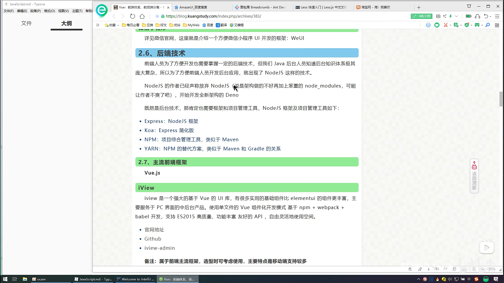

# 【狂神说Java】JavaScript最新教程通俗易懂

# Intro to Javascript





1.什麼是Javascript
Javascript是世界上最流行的腳本語言

__一個合格的後端人員，必須精通Javascript__

## ecmascript

ecmascript可以理解為是Javascript的一個標準
最新版本已經到es6版本
但是大部分瀏覽器還只停留在支持es5代碼上
開發環境---線上環境，版本不一致

關鍵字，變量.流程控制.對象.數組.結構

# 快速入門

## 引入JavaScript

內部標籤

```html
    <!--script標籤內，寫Javascript代碼-->
<!--    <script>-->
<!--        alert('hello,world');-->
<!--    </script>-->
```

外部引入
test.html

```html
    <!--    外部引入-->
<!--    注意:script，必須成對出現-->
<script src="./js/1.js"></script>
```

1.js

```javascript
alert('hello,world');
```

# 基本語法入門

intellij改成支持es6


瀏覽器developer tool 常用功能


# 數據類型

數值，文本，圖形，音頻，視頻...

__變量__
注意不可數字開頭

```javascript
var number = 1;

//比較特別，變量名用中文可接受，但不建議使用

var 王者榮耀 = '倔強青銅';
console.log(王者榮耀)
```

__number__

js不區分小數和整數

```javascript
123  //整數123
123.1 //浮點數123.1
1.123e3 //科學計數法
- 99//負數
Nan  //not a number
Infinity //無窮大

```

__字符串__
'abc'

"abc"

__布爾值__
true
false

__邏輯運算__

```javascript
//&& 兩者都為真，結果為真

//|| 一個為真，結果為真

//! 真即假，假即真
```

__比較運算符!!!! 重要__

```javascript
//= 這是賦值，別搞錯

//== //等於(類型不一樣，值一樣，也會判斷為true)

//=== //絕對等於(類型一樣，值一樣，會判斷為true)

```

這是一個JS的缺陷，堅持不要使用==比較

須知；

+ NaN === NaN ，這個與所有的數值都不相等，包括自己
+ 只能通過isNaN(NaN)來判斷這個數是否是NaN

浮點數問題:

```javascript
<!--  這兩個值相等嗎?-->
console.log((1 / 3) === (1 - 2 / 3))
```

會return false

盡量避免使用浮點數進行運算，存在精度問題

```javascript
    console.log(Math.abs((1 / 3) - (1 - 2 / 3)) < 0.000001)
//    return true
```

__null和undefined__

+ null是空
+ undefined是未定義

__數組__

一系列相同類型的值

Java的數組必須是相對類型的對象，JS中不需要這樣！

```javascript
    //保證代碼的可讀性，盡量使用[]
var arr = [1, 2, 3, 4, 5, 'hello', 'null', true];

new Array(1, 2, 3, 4, 5, 'hello', 'null', true);
```

取數組下標:如果越界了，就會undefined

__對象__

對象是大括號，數組是中括號

，每個屬性之間使用逗號隔開，最後一個不需要添加

```javascript
    //Java  Person person = new Person();
    //JS
var person = {
    name: "danny",
    age: 3,
    tags: ['js', 'java', 'web', '...']


}

```

取對象的值

```bash
person.name
> "danny"
person.age
> 3

```

# 嚴格檢查模式 'use strict'

```javascript
/**嚴格檢查模式，預防Javascript的隨意性，導致產生的問題
 *局部變量建議都使用let去定義
 *注意:IDEA要設置支持es6語法
 * 必須寫在第一行
 */

'use strict';
//全局變量
i = 1;//從原本合法變成不合法
//局部變量
var j = 1;
//es6 使用let 或 const
let k =1;
```

# 數據類型


