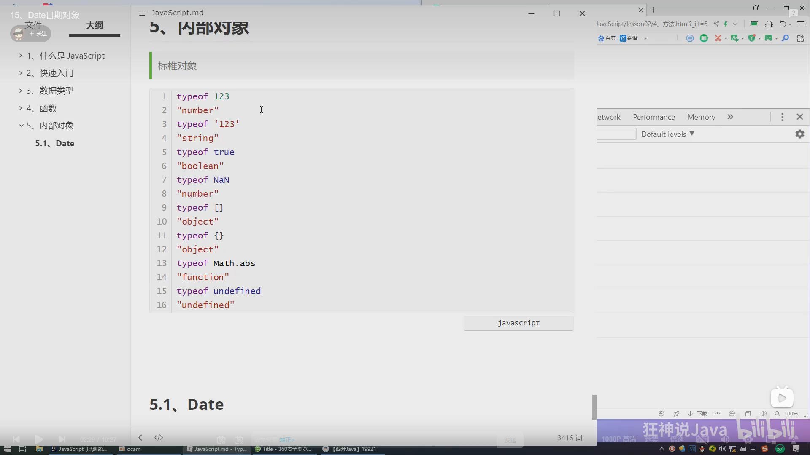
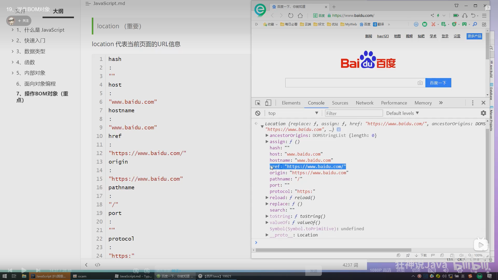

# 【狂神说Java】JavaScript最新教程通俗易懂

# 1.大綱
## 閉包(難點)

## 箭頭函數(新特性)

## 創建對象

## class繼承(新特性)

## 原型鍊繼承(難點)

# 常用對象

## Date

## JSON

# 操作Dom元素

## 插入Dom

## 更新Dom

## 刪除Dom

# 操作Bom元素

## window

## navigator

## screen

## location

## Document

## History

## 操作表單

## 操作文件

# Intro to Javascript


## 什麼是Javascript

Javascript是世界上最流行的腳本語言

__一個合格的後端人員，必須精通Javascript__

## ecmascript

ecmascript可以理解為是Javascript的一個標準
最新版本已經到es6版本
但是大部分瀏覽器還只停留在支持es5代碼上
開發環境---線上環境，版本不一致

關鍵字，變量.流程控制.對象.數組.結構

# 快速入門

## 引入JavaScript

內部標籤

```html
    <!--script標籤內，寫Javascript代碼-->
<!--    <script>-->
<!--        alert('hello,world');-->
<!--    </script>-->
```

外部引入
test.html

```html
    <!--    外部引入-->
<!--    注意:script，必須成對出現-->
<script src="./js/1.js"></script>
```

1.js

```javascript
alert('hello,world');
```

# 基本語法入門

intellij改成支持es6


瀏覽器developer tool 常用功能


# 數據類型

數值，文本，圖形，音頻，視頻...

__變量__
注意不可數字開頭

```javascript
var number = 1;

//比較特別，變量名用中文可接受，但不建議使用

var 王者榮耀 = '倔強青銅';
console.log(王者榮耀)
```

__number__

js不區分小數和整數

```javascript
123  //整數123
123.1 //浮點數123.1
1.123e3 //科學計數法
- 99//負數
Nan  //not a number
Infinity //無窮大

```

__字符串__
'abc'

"abc"

__布爾值__
true
false

__邏輯運算__

```javascript
//&& 兩者都為真，結果為真

//|| 一個為真，結果為真

//! 真即假，假即真
```

__比較運算符!!!! 重要__

```javascript
//= 這是賦值，別搞錯

//== //等於(類型不一樣，值一樣，也會判斷為true)

//=== //絕對等於(類型一樣，值一樣，會判斷為true)

```

這是一個JS的缺陷，堅持不要使用==比較

須知；

+ NaN === NaN ，這個與所有的數值都不相等，包括自己
+ 只能通過isNaN(NaN)來判斷這個數是否是NaN

浮點數問題:

```javascript
<!--  這兩個值相等嗎?-->
console.log((1 / 3) === (1 - 2 / 3))
```

會return false

盡量避免使用浮點數進行運算，存在精度問題

```javascript
    console.log(Math.abs((1 / 3) - (1 - 2 / 3)) < 0.000001)
//    return true
```

__null和undefined__

+ null是空
+ undefined是未定義

__數組__

一系列相同類型的值

Java的數組必須是相對類型的對象，JS中不需要這樣！

```javascript
    //保證代碼的可讀性，盡量使用[]
var arr = [1, 2, 3, 4, 5, 'hello', 'null', true];

new Array(1, 2, 3, 4, 5, 'hello', 'null', true);
```

取數組下標:如果越界了，就會undefined

__對象__

對象是大括號，數組是中括號

，每個屬性之間使用逗號隔開，最後一個不需要添加

```javascript
    //Java  Person person = new Person();
    //JS
var person = {
    name: "danny",
    age: 3,
    tags: ['js', 'java', 'web', '...']


}

```

取對象的值

```bash
person.name
> "danny"
person.age
> 3

```

# 嚴格檢查模式 'use strict'

```javascript
/**嚴格檢查模式，預防Javascript的隨意性，導致產生的問題
 *局部變量建議都使用let去定義
 *注意:IDEA要設置支持es6語法
 * 必須寫在第一行
 */

'use strict';
//全局變量
i = 1;//從原本合法變成不合法
//局部變量
var j = 1;
//es6 使用let 或 const
let k = 1;
```

# 數據類型

1. 正常字符串我們使用單引號或者雙引號包裹
2. 注意轉義字符

```text
\'
\n
\t
\u4e2d \u#### Unicode字符

\x41 ascii字符


```

3. 多行字符串編寫

```javascript
    'use strict'

//tab上面 esc鍵下面
var msg = `hello
    world
    
    你好`;
console.log(msg)
```

4. 模板字符串

```javascript
    'use strict'
let name = 'danny'
//tab上面 esc鍵下面
let msg = `hello
    world
    ${name}
    你好`;
console.log(msg)
```

5. 字符串長度
   str.length

```javascript
let student = "student";
console.log(student.length);
console.log(student[0]);

```

6. 字符串的可變性，不可變

```javascript
studnet[0] = 1
console.log(student);
//student 賦值失敗
```


7. 大小寫轉換

```javascript
//注意這裡是方法，不是屬性了
student.toUpperCase()
student.toLowerCase()

```

8. IndexOf

```javascript
console.log(student.indexOf('t'));
```

9. substring

```javascript
console.log(student.substring(1));//從第一個字符串擷取到最後一個字符串
console.log(student.substring(1, 3));//包含前面，不包含後面

```

# 數組

Array可以包含任意的數據類型

```javascript
var arr = [1, 2, 3, 4, 5, 6];//通過下標取值和賦值
console.log(arr);
arr[0];//取值
a44[0] = 1;//賦值
```

1. 長度

```javascript
arr.length
```

注意；通過給arr.length賦值，數組大小就會發生變化，並不會報錯，多的位置值為undefined，如果賦值過小，元素就會丟失

2. indexOf，通過元素獲得下標索引

```javascript
arr.indexOf(2)
```

return index of element

```javascript
var arr = [1, 2, 3, 4, 5, 6, '1', '2'];
console.log(arr.indexOf(1));
console.log(arr.indexOf('1'));

```

字符串的"1"和數字1是不同的

3. slice() 截取Array的一部分，返回一個新數組，類似String中的substring

```javascript
arr.slice(3);
```

4. push() , pop() 尾部

push():壓入到尾部
pop():彈出尾部的一個元素

```javascript
arr.push('a', 'b');
arr.pop();
```

```bash
arr
> [1, 2, 3, 4, 5, 6]
arr.push('a','b');
> 8
arr
> [1, 2, 3, 4, 5, 6, 'a', 'b']
arr.pop()
> 'b'
arr
> [1, 2, 3, 4, 5, 6, 'a']
```

5. unshift(),shift()頭部
   unshift():壓入到頭部
   shift():彈出頭部的一個元素

6. 排序sort()

```bash
['B','C','A']
arr.sort()
['A','B','C']

```

7. 元素反轉 reverse()

```bash
['B','C','A']
arr.sort()
['C','B','A']
```

8. concat()

```bash
arr
['C','B','A']
arr.concat([1,2,3]);
['C','B','A',1,2,3]
arr
['C','B','A']
```

注意:concat()並沒有修改數組，只是會返回一個新的數組

9. 連接符 join
   打印拼數組，使用特定的字符串連接

```bash
arr
['C','B','A']
arr.join('-')
'C-B-A'
```

10. 多維數組

```bash
arr = [[1,2],[3,4],[5,6]]
arr[0][0]
1
```

11. fill()

```bash
arr.fill(1)
[1, 1, 1]
```

數組:存儲數據的集合框架(如何存，如何取)

# 對象

若干個鍵值對

```javascript
var 對象名 = {
    屬性名: 屬性值,
    屬性名: 屬性值,
    屬性名: 屬性值
}

//定義了一個對象，他有四個屬性
var person = {
    name: "kuangshen",
    age: 3,
    email: "11111.qq.com",
    score: 0
}
```

JS中對象，{....}表示一個對象，鍵值對描述屬性xxxx:xxxx，多個屬性之間使用逗號隔開
，最後一個屬性不加逗號!

JS中的所有鍵都是字符串，值是任意對象!

1. 對象賦值

```bash
person.name = "qinjiang"
"qinjiang"
person.name
"qinjiang"
```

2. 使用一個不存在的對象屬性，不會報錯，會返回 undefined

```bash 
person.haha
undefined
```

3. 動態的刪除屬性

```bash
person
{name: 'kuangshen', age: 3, email: '11111.qq.com', score: 0}
delete person.name
true
person
{age: 3, email: '11111.qq.com', score: 0}
```

4. 動態的增加屬性，直接給新的屬性添加值即可

```bash
person.haha = 'haha'
'haha'
person
{age: 3, email: '11111.qq.com', score: 0, haha: 'haha'}
```

5. 判斷屬性值是否在這個對象中 xxx in xxx

```bash
person
{age: 3, email: '11111.qq.com', score: 0, haha: 'haha'}
'age' in person
true 
//繼承來的
'toString' in person
true
```

6. 判斷一個屬性是否是這個對象自身擁有的

```bash
person.hasOwnProperty('toString')
false
person.hasOwnProperty('age')
true
```

# 流程控制

if判斷

```javascript
  var age = 3;
if (age > 3) {//第一個判斷
    alert('haha');
} else if (age < 5) {//第二個判斷
    alert('2')
} else {//否則
    alert('kuwa')
}
```

while 循環，注意程序死循環
do while

```javascript
  var age = 3;
while (age < 100) {
    age = age + 1;
    console.log(age)
}
var age = 3;
do {
    age = age + 1;
} while (age < 100)

```

for循環

```javascript
    var age = 3;
for (let i = 0; i < 100; i++) {
    console.log(i);
}


```

__foreach 循環__  es5.1就有

```javascript

var age = [12, 3, 12, 3, 12, 3, 12, 3, 12, 3, 12, 3];
//函數
age.forEach(function (value) {
    console.log(value)
})
```

for...in 循環

```javascript
/**Java
 * for(Type str: element){
 *     statement
 * }
 *
 * JS
 * for(var index in obj){
 *     statement
 * }
 *
 * @type {number[]}
 */
var age = [12, 3, 12, 3, 12, 3, 12, 3, 12, 3, 12, 3];
for (var index in age) {
    console.log(index);//會出索引值
    console.log(age[index]);//提出數組元素值

}
```

# Map 和 Set  ES6的新特性

Map :有序、可重複

```javascript
   //es6 Map 很像python裡面的字典dictionary
// new Map();
// new Set();

//學生的成績，學生的名字
// var names =["tom","jack"];
// var score = [60 , 50];

var map = new Map([['tom', 99], ['jack', 50]]);
console.log(map.get('tom'));//通過key獲得value
map.set('admin', 100);//新增一個元素
console.log(map);
map.delete('tom');//刪除一個元素
console.log(map);
```

```bash
map
Map(3){'tom' => 99, 'jack' => 50, 'admin' => 100}
```

Set:無序，不重覆的集合

```javascript
var set = new Set([3, 1, 3, 1, 3, 1]);//set可以去重覆
set.add(5)//添加元素
/*
//set
// Set(3) {3, 1, 5}
 */
set.delete(1)//刪除元素
/*
set
Set(2) {3, 5}
 */
console.log('has:', set.has(3));//判斷3是否在set集合裡面

console.log(Array.from(set))//輸出set所有元素變成array
```

```bash
set
Set(2){3, 1}
```

# iterator  es6新特性

作業:使用iterator來便利迭代Map,Set!

遍歷數組

```javascript
var arr = [3, 4, 5]
arr.name = '123';//早期的漏洞
for (var x in arr) {
    console.log(x)//輸出index
}
for (var x of arr) {
    console.log(x)//輸出value
}
```

如果插入新屬性，會是什麼情況?

for in 會輸出name屬性，早期的漏洞

for of 不會輸出name屬性

遍歷Map

```javascript
var map = new Map([['tom', 100], ['jack', 50], ['haha', 90]]);
for (let x of map) {
    console.log(x)
}
```

遍歷Set

```javascript
    var set = new Set([1, 2, 3, 4, 5]);
for (let x of set) {
    console.log(x)
}
```

參考網站


# 函數及面向對象

## 函數定義及變量作用域

## 函數

方法:對象(屬性，方法)
函數:單獨存在的方法

## 定義函數

java
----

```java
public 返回值類型 方法名(){
        return 返回值;
        }
```

javascript
----
定義方式一
絕對值函數

```javascript
function abs(x) {
    if (x >= 0) {
        return x;
    } else {
        return -x;
    }
}
```

一旦執行到return代表函數結束，返回結果

如果沒有執行return ，函數執行完也會返回結果，結果值為undefined

定義方式二

```javascript
var abs = function (x) {
    if (x >= 0) {
        return x;
    } else {
        return -x;
    }
}
```

function(x){...}這是一個匿名函數，但是可以把結果賦值給abs，通過abs就可以調用函數！

方式一和方式二等價

```text
abs(10) //10
abs(-10) //10

```

神奇的javascript

參數問題:javascript 可以傳任意個參數，也可以不傳遞參數
參數進來是否存在的問題?
假設不存在參數，如何規避?

```javascript
        var abs = function (x) {
    if (typeof x !== 'number') {
        throw 'Not a number'//手動拋出異常
    }
    if (x >= 0) {
        return x;
    } else {
        return -x;
    }
}
```

```javascript
// arguments
var abs = function (x) {
    // arguments
    console.log("x=>" + x);
    for (var i = 0; i < arguments.length; i++) {
        console.log(arguments[i]);
    }
    if (arguments.length > 1) {
        arguments[1];
    }
```


arguments是一個JS免費贈送的關鍵字;

代表，傳遞進來的所有參數，是一個數組。

```javascript
var abs = function (x) {
    // arguments
    // console.log("x=>"+x);
    for (var i = 0; i < arguments.length; i++) {
        console.log(arguments[i]);
    }
    // if(arguments.length>1){
    //     arguments[1];
    // }

    if (arguments.length === 2) {

    } else if (arguments.length === 2) {

    }


    // if(typeof x!=='number'){
    //     throw 'Not a number'//手動拋出異常
    // }
    if (x >= 0) {
        return x;
    } else {
        return -x;
    }
}
```

問題: arguments包含所有的參數，我們有時候想使用多於的參數來進行附加操作
。需要排除已有的參數

__rest__

以前:

```javascript
        if (arguments.length > 2) {
    for (var i = 2; i < arguments.length; i++) {
//todo
    }
```

ES6引入的新特性，獲取除了已經定義的參數之外的所有參數。

```javascript
    function aaa(a, b, ...rest) {
    console.log("a=>" + a);
    console.log("b=>" + b);
    console.log(rest);

}
```

結果


rest參數只能寫在最後面，必須用...表示

# 變量的作用域

在JS中，var定義變量實際有作用域的

假設在函數體中聲明，則在函數體外不可以使用~ (涉及到閉包)

(非要想實現的話，後面可以研究一下閉包)

```javascript
'use strict'

function qj() {
    var x = 1;
    x = x + 1;
}

x = x + 2;//Uncaught ReferenceError: x is not defined
```

##### 如果兩個函數使用了相同的變量名，只要在函數內部，就不衝突

```javascript
function qj() {
    var x = 1;
    x = x + 1;
}

function qj2() {
    var x = 'A';
    x = x + 1;
}
```

### 內部函數可以訪問外部函數的成員，反之則不行

```javascript
      function qj() {
    var x = 1;

    //內部函數可以訪問外部函數的成員，反之則不行
    function qj2() {
        var y = x + 1;
        x = x + 1;
    }

    var z = y + 1;
}
```

假設，內部函數變量和外部函數的變量，重名!

```javascript
      function qj() {
    var x = 1;


    function qj2() {
        var x = 'A';
        console.log('inner=' + x);
    }

    qj2();
    console.log('outer=' + x);
}

qj();
```

假設在Javascript中函數查找變量從自身函數開始，由"內"向"外"查找，假設外部存在這個同名的函數變量，則內部函數會屏蔽外部函數的變量

#### 提升變量的作用域

```javascript
      function qj() {
    var x = "x" + y;//未宣告變量y
    console.log(x);
    var y = 'y';
}

// function qj2(){//等同於qj()
//     var y;
//     var x = "x" + y;
//     console.log(x);
//     var y = 'y';
// }
```

結果:'xundefined'

說明:JS執行引擎，自動提升了y的聲明，但是不會提升變量y的賦值:

```javascript
      function qj2() {//等同於qj()
    var y;
    var x = "x" + y;
    console.log(x);
    var y = 'y';
}
```

這是在JS建立之初就存在的特性，養成規範：所有的變量定義都放在函數的頭部，不要亂放，便於代碼維護

```javascript
      function qj2() {//等同於qj()
    //把變量宣告提到最前面
    // var x,y,z...;
    var x = "x" + y;
    console.log(x);
    var y = 'y';
}

function qj2() {//等同於qj()
    //把變量宣告提到最前面
    var x = 1,
        y = x + 1,
        z,
        i

    //之後隨意用

    x = 'a';

}
```

#### 全局函數

```javascript
        //全局變量
var x = 1;

function f() {
    console.log(x);
}

f()
console.log(x)
```

#### 全局對象 window

```javascript
         //全局對象
var x = 'xxx';
// alert(x);
// alert(window.x);//默認所有的全局變量，都會自動綁定在window對象下。
//alert也是綁訂在window下
window.alert(x);
window.alert(window.x);//默認所有的全局變量，都會自動綁定在window對象下。
```
alert() 這個函數本身也是一個 `window` 變量

```javascript
var x ='xxx';
        window.alert(x);

        var old_alert= window.alert;

        // old_alert(x);//成功

        window.alert = function (){

        }
        window.alert(123);//發現alert失效了

        //恢復
        window.alert = old_alert();
        window.alert(456);
```
JS實際上只有一個全局作用域，任何變量(函數也可以視為變量)，假設沒有在函數作用範圍內找到，
就會向外查找，如果在全局作用域都沒有找到，報錯`refrence error`

``規範``
在以前，JS中沒有常量，約定變量名大寫就視為常量，不可以重新賦值。(但其實是變量)

由於我們所有的全局變量都會綁定到我們的window上，如果不同的js文件，使用了相同的全局變量，
會發生衝突，如何能夠減少衝突?

```javascript
       //唯一全局變量
        var KuangshenApp = {};

        //定義全局變量
        KuangshenApp.name = 'Kuangshen';
        KuangshenApp.add = function (a, b) {
            return a + b;
        }
```

把自己的代碼全部放入自己定義的唯一空間名字中，降低全局命名衝突的問題

例如:jQuery模組

``局部作用域 let const``
var有問題
```javascript
//var有問題
function app(){
for(var i = 0;i < 100;i++){
console.log(i)
}
console.log(i+1);//問題? i出了這個作用域還可以使用
}
```
ES6 let關鍵字，解決局部作用域衝突問題!
```javascript
//let
        function app(){
            for(let i = 0;i < 100;i++){
                console.log(i)
            }
            console.log(i+1);//Uncaught ReferenceError: i is not defined
        }

```

``常量 const``
在ES6之前，怎麼定義常量:只有用全部大寫字母命名就是常量;建議不要修改這樣的值?

```javascript
//以前
        var PI = '3.14';
        console.log(PI);
        PI = '213';//可以改變這個值
        console.log(PI);
```
在ES6引入了常量關鍵字 `const`
```javascript
        //const
        const PI = '3.14';//只讀變量
        console.log(PI);
        PI = '213';//可以改變這個值
        console.log(PI);//Uncaught TypeError: Assignment to constant variable.
```

## 方法
`定義方法`
方法就是把函數放在對象的裡面，對象只有兩個東西:屬性和方法
```javascript
    //方法
    var kuangshen ={
        name:'秦疆',
        birth:2020,
        //方法
        age:function(){
            //今年-出生的年
            var now = new Date().getFullYear();
            return now - this.birth


        }
    }
    //屬性
kuangshen.name
//方法，一定要帶 ()
kuangshen.age()
```
this.代表什麼?拆開上面的代碼看看
this會指向調用他的人
```javascript
    // 方法
    function getAge(){
        //今年-出生的年
        var now = new Date().getFullYear();
        return now - this.birth
    }
    var kuangshen ={
        name:'秦疆',
        birth:2020,
        //方法
        age:getAge
       
    }
//kuangshen.age()  成功
//getAge()  NaN  因為是window調用，而window中沒有birth屬性
```
this是無法指向的，是默認指向調用他的那個對象;

``apply``
在JS中可以控制this指向!
```javascript
//apply
    function getAge(){
        //今年-出生的年
        var now = new Date().getFullYear();
        return now - this.birth
    }
    var kuangshen ={
        name:'秦疆',
        birth:2020,
        //方法
        age:getAge
    }
    //kuangshen.age()  成功
    //getAge()  NaN

    var a = getAge.apply(kuangshen,[]);//this,指向了kuangshen,參數為空
    console.log(a)
```

# 內部對象
標準對象



# Date對象
基本使用

```javascript
var now = new Date();
// console.log(now);//Mon Jan 02 2023 05:17:17 GMT+0800 (台北標準時間)
now.getFullYear();//年
now.getMonth();//月
now.getDate()//日
now.getDay()//星期幾
now.getHours();//時
now.getMinutes();//分
now.getSeconds();//秒

now.getTime();//時間戳 全世界唯一 1970.1.1  00:00:00 毫秒數

//時間戳轉為時間
// console.log(new Date(1672608316563))//Mon Jan 02 2023 05:25:16 GMT+0800 (台北標準時間)

now.toLocaleString()//'2023/1/2 上午5:27:28'
```

轉換


# JSON對象

bson

`json是什麼`
早期，所有數據傳輸都使用xml文件


在JS中一切皆為對象，任何JS支持的類型都可以用JSON來表示;
格式:
+ 對象都用 {{
+ 數組都用[]
+ 所有的鍵值對都是用key:value


JSON字符串和JS對象的轉化
```javascript
// var user = {
        //     name:'qinjiang',
        //     age:'3',
        //     sex:'男'
        // }

        // console.log(user);

        //對象轉化為json字符串
        // var jsonUser = JSON.stringify(user);//'{"name":"qinjiang","age":"3","sex":"男"}'

        //json字符串轉化為對象 參數為json字符串
        var obj = JSON.parse('{"name":"qinjiang","age":"3","sex":"男"}');
```
很多人搞不清楚，JSON和JS對象的區別
```javascript
var obj = {a:'hello',b:123};

var json = '{"a":"hello","b":"123"}';
```


# AJAX
+ 原生的JS寫法 xhr異步請求
+ jQuery封裝好的方法 //$("#name").ajax("")
+ axios 請求

# 面向對象編程

## 什麼是面向對象
## 原型對象
JS java c# 面向對象
JS有些區別
面向對象
類:模板      JS:原型對象
對象:具體的實例

在JS中這個需要大家換一下思維方式
原型 prototype :
```javascript
//原型對象
        var Student = {
            name:'qinjiang',
            age:'3',
            sex:'男',
            run:function (){
                console.log(this.name + " run...")
            }
        }

        var ming = {
            name:"ming"
        }
        
        //原型對象
        //小明的原型 是 Student
        ming.__proto__ = Student;

        var Bird = {
            fly:function (){
                console.log(this.name + " fly...")
            }
        }

        ming.__proto__ = Bird;
```


# class繼承
```javascript
//早期
// function Student(name) {
        //     this.name = name;
        // }

        //早期 : 如何給Student新增一個方法，使用原型
        // Student.prototype.hello=function (){
        //     alert("hello")
        // }

        //ES6
        //定義一個學生的類
        class Student{
            constructor(name) {
                this.name = name;
            }
            hello(){
                alert("hello")
            }
        }
```
class關鍵字，是在ES6引入的
1. 定義一個類，屬性，方法
```javascript
//ES6
//定義一個學生的類
class Student{
   constructor(name) {
      this.name = name;
   }
   hello(){
      alert("hello")
   }
}

var ming = new Student("ming");

console.log(ming.hello())

var danny = new Student("danny");
```

2. 繼承

```javascript
//繼承
        //定義一個學生的類
        class Student{
            constructor(name) {
                this.name = name;
            }
            hello(){
                alert("hello")
            }
        }
        //繼承
        class xiaoStudent extends Student{
            constructor(name,grade) {
                super(name);
                this.grade = grade;
            }
            myGrade(){
                alert('5年級')
            }
        }

        var danny = new xiaoStudent("danny",5);

        console.log(danny.myGrade());
```
本質:查看對象原型


## 原型鏈


一個環形的鏈
`__proto__`:

# 操作BOM對象(重點)
B/S
B:瀏覽器
BOM:瀏覽器對象模型
``瀏覽器介紹``
JS 和 瀏覽器關係?
JS誕生就是為了能夠讓他在瀏覽器中運行!
+ IE windows
+ Chrome google跨平台
+ Safari 蘋果
+ Firefox Linux

第三方瀏覽器
+ QQ瀏覽器
+ 360瀏覽器


``window(重要)``
window 代表瀏覽器窗口


``Navigator``
Navigator，封裝了瀏覽器的信息


大多數時候，我們不會使用`navigator`對象，因為會被人為修改
不建議使用這些屬性來判斷和編寫代碼

`screen`


`location(重要)`

location代表當前頁面的URL信息



`document`

代表當前的頁面，HTML DOM文檔樹
```javascript
document.title

document.title='danny'

```


獲取具體的文檔樹節點

獲取cookie
```javascript
document.cookie
```
劫持cookie的原理

單點登入的一種方法

httpOnly
服務器端可以設置 cookie:httpOnly

`history`

history代表瀏覽器的歷史紀錄

# 操作DOM對象(重點)
DOM:文檔對象模型
  

`核心`
瀏覽器網頁就是一個DOM樹形結構
+ 更新:更新 DOM節點
+ 遍歷dom節點：得到dom節點
+ 


