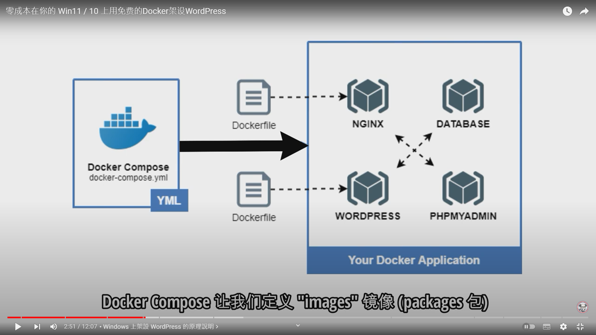

### 

[github](https://gist.github.com/kiddtang/0cf9f8bd9e6dda41fb084d9ebcf7c521)

可以在檔案總管地址欄中輸入\\wsl$

打開wordpress資料夾輸入code . 用vscode開啟
建立.env文件輸入

MYSQL_ROOT_PASSWORD=your_root_password
MYSQL_USER=your_wordpress_database_user
MYSQL_PASSWORD=your_wordpress_database_password

建立nginx配置文件夾
mkdir ~/wordpress/nginx-conf

nginx.conf

mkdir -p ~/wordpress/.docker/nginx

mkdir -p ~/wordpress/.docker/wordpress

uploads.ini

docker-compose.yml

準備完成!在ubuntu/wordpress中
docker-compose up -d

關閉container

docker-compose down