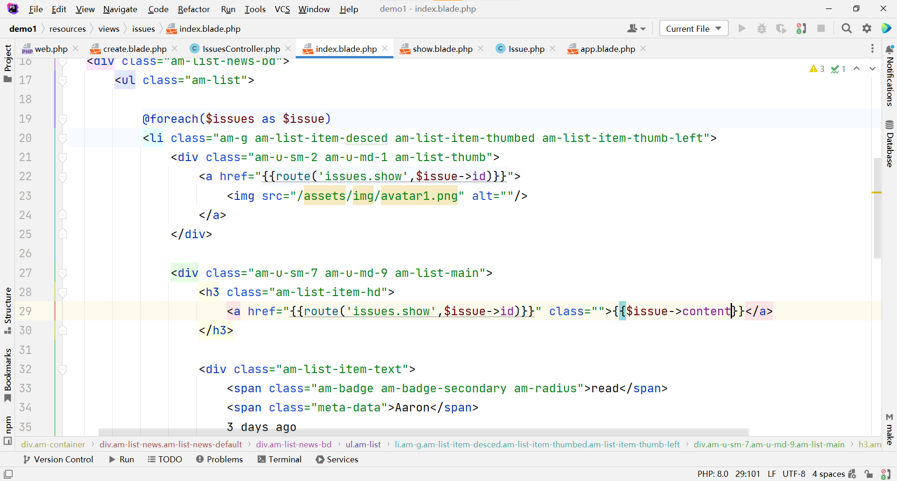
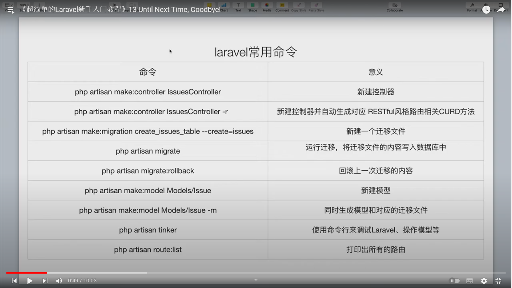
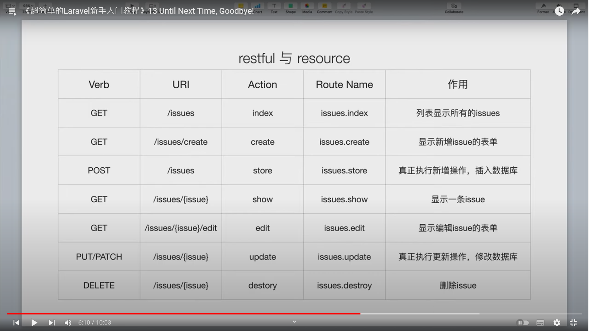
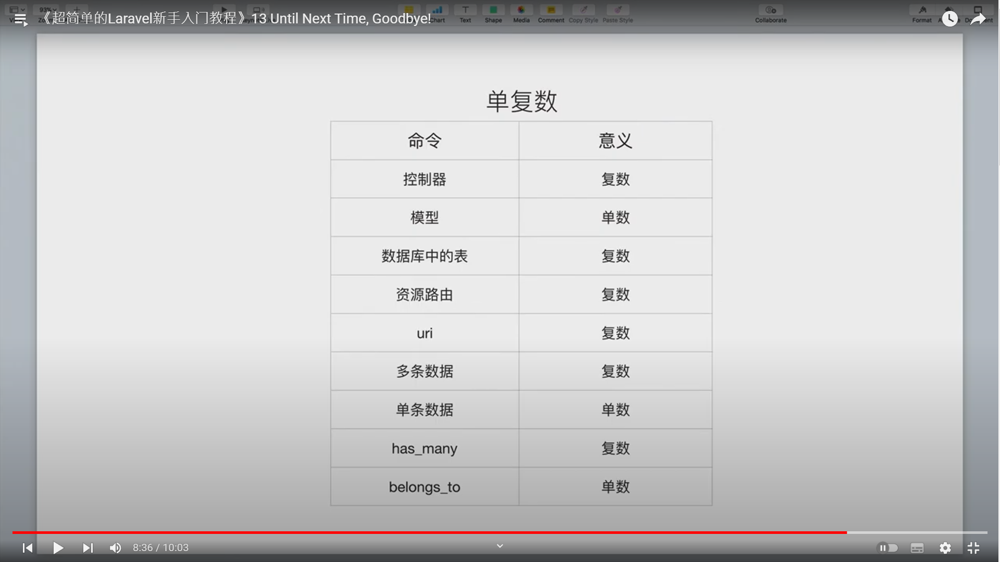

## 超簡單的Laravel新手入門

###  MVC結構


### 笨辦法發消息


### 數據庫

php artisan make:migration create_issues_table --create=issues

php artisan migrate

php artisan make:model Models/Issue

php artisan tinker

use App\Models\Issue

Issue::create(['title'=>'PHP lover'])
Issue::create(['title'=>'Rails and Laravel'])
Issue::all()


開啟操作表

protected $fillable=['title'];


## 07瞄準一個東東來CRUD

php artisan make:migration add_content_to_issues_table --table=issues

$table->text('content');

$table->dropColumn('content');

php artisan migrate

//在tinker中插入數據
php artisan tinker
use App\Models\Issue

$i= Issue::find(1)

$i->content="The PHP Framework For Web Artisans"

$i->save()

$i= Issue::find(2)

$i->content="Image what you could build if you learned Ruby on Rails ..."

$i->save()

//新增Controller
```php
Route::get('issue/{issue}'),'IssuesController@show');
Route::get('issue/{issue}',[IssuesController::class, 'show']);

```


```bash
php artisan make:controller IssuesController -r    //-r代表使用系統預設的7個方法
```


```php
public function show($id)
    {
        return $id;
    }
```


```php
public function show($id)
    {
        $issue = Issue::find($id);
        return $issue;
    }
```

```php
public function show($id)
    {
        $issue = Issue::find($id);
        return view('issues.show')->with('issue',$issue);
    }
```    

修改_issue_list.blade.php

```html
{{-- <a href="issues_show.html" class="">{{$issue['title']}}</a> --}}
                          
{{-- <a href="/issues/{{$issue->id}}" class="">{{$issue->title}}</a> --}}

//改成

<a href="{{route('issue.show',$issue->id)}}" class="">{{$issue->title}}</a>
```

加上刪除功能
```html
<a type="button" class="am-btn am-btn-danger am-radius am-btn-sm">Destroy</a>

改成

<a href="{{route('issue.destory',$issue->id)}}" type="button" class="am-btn am-btn-danger am-radius am-btn-sm">Destroy</a>
```

<script src="/assets/js/laravel.js"></script>


```php
public function destroy($id)
    {
        Issue::destory($id);
        return redirect('/');
    }
```

### 08 網站的耳朵

<a href="issues_create.html" class="am-btn am-btn-default am-btn-secondary">发布新活动</a>
<a href="{{route('issue.create')}}" class="am-btn am-btn-default am-btn-secondary">发布新活动</a>


public function create()
{
return view('issues.create');
}

<form class="am-form" action="{{route('issues.store')}}" method="post">


public function store(Request $request)
{
return $request->all();
}

加上{{csrf_field()}}


### 09天啊，一大堆issues(分頁)
<li><a href="issues_index.html">活动</a></li>
<li><a href="{{route('issues.index')}}">活动</a></li>

Route::get('issues',[IssuesController::class, 'index'])
->name('issue.index');
```php
public function index()
    {
        $issues = Issue::orderBy('created_at','desc')->get();
        return view('issues.index')->with('issues',$issues);
    }


```


使用分頁功能
public function index()
{
$issues = Issue::orderBy('created_at','desc')->get();
//        return  $issues;
return view('issues.index')->with('issues',$issues);
}

### 10更新一個資源

<a href="{{route('issues.edit',$issue->id)}}" type="button" class="am-btn am-btn-primary am-radius am-btn-sm">Edit</a>

    public function edit($id)
    {
        $issue = Issue::find($id);
//        return $issue;
return view('issues.edit')->with('issue',$issue);
}

Browser只能發出get與post請求
要使用put請求
Lavavel提供方法加上
{{method_field('PUT')}}

### 11 code Beauty(Rescurse Controllers)

使用Resource Route

Route::resource('issue','IssuesControlller');

查看route list
php artisan route:list

issue 模板 日期從寫死的改從數據庫提出
{{$issue->created_at->diffForHumans()}}

### 12 添加評論

一對多 has many  belongs to

php artisan make:model Models/Comment -m

public function up()
{
Schema::create('comments', function (Blueprint $table) {
$table->id();
$table->integer('issue_id');
$table->string('name');
$table->string('email');
$table->string('content');
$table->timestamps();
});
}

php artisan migrate
show模板
<form class="am-form" method="post" action="{{route('comments.store')}}">
        {{csrf_field()}}
<input type="hidden" name="issue_id" value="{{$issue->id}}">

新建CommentsController
php artisan make:controller CommentsController

先檢驗數據是否有傳到後端
```php
class CommentsController extends Controller
{
    public function store(Request $request){
        return $request->all();

    }
}
```

public function store(Request $request){
Comment::create($request->all());
return back();

    }

class Comment extends Model
{
use HasFactory;
protected $fillable=['name','email','content','issue_id'];
}

建立has many belongs to 模型

class Issue extends Model
{
use HasFactory;
protected $fillable=['title','content'];

    public function comments(){
        return $this->hasMany('App\Models\Models\Comment');
    }
}

class Comment extends Model
{
use HasFactory;
protected $fillable=['name','email','content','issue_id'];

    public function issue(){
        return $this->belongsTo('App\Models\Models\Issue');
    }
}
將IssueController
    public function show($id)
    {
        $issue = Issue::find($id);
        //當前issue的comments
        $comments = $issue->comments;
        return $comments;
//        return view('issues.show')->with('issue',$issue);
}

    public function show($id)
    {
        $issue = Issue::find($id);
        //當前issue的comments
        $comments = $issue->comments;
//        return $comments;
//        return view('issues.show')->with('issue',$issue)->with('comments',$comments);
return view('issues.show', compact('issue','comments'));
}



### 13 Until next time

<a href="issues_show.html">2</a>






