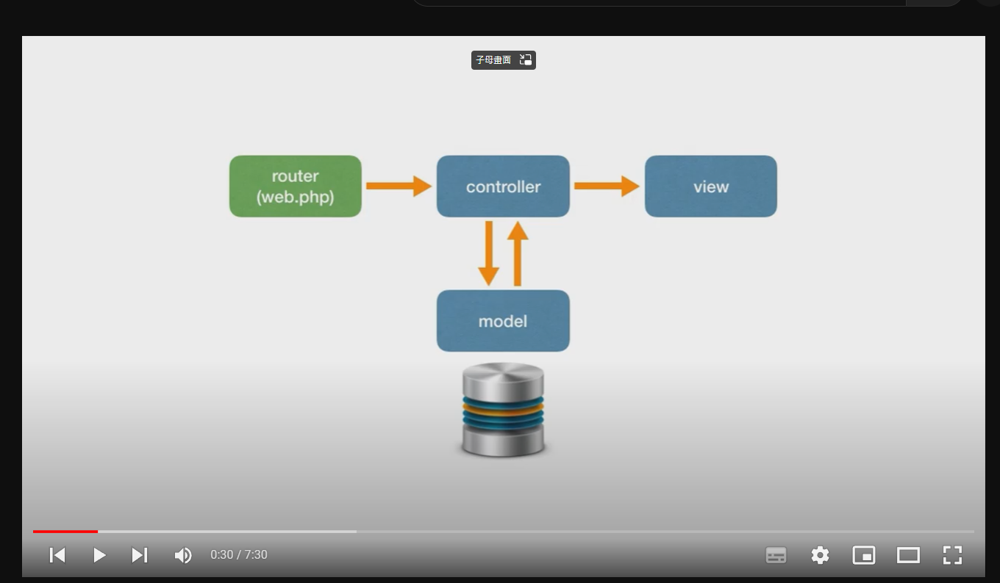
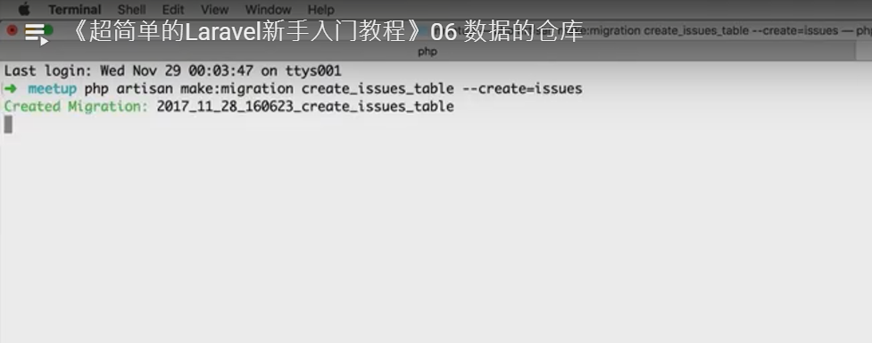
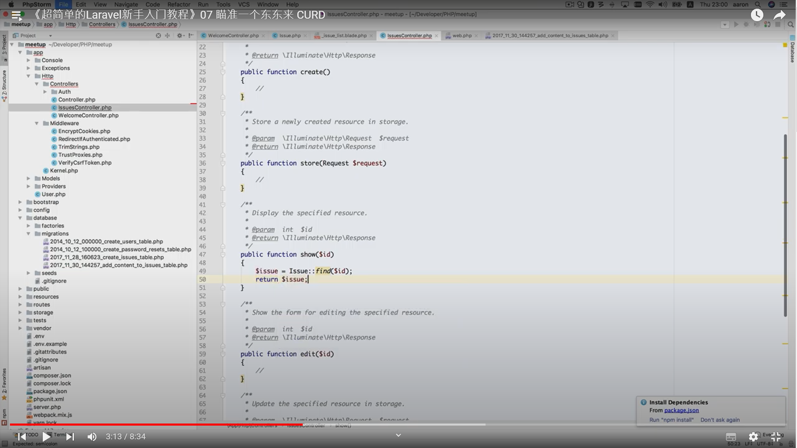
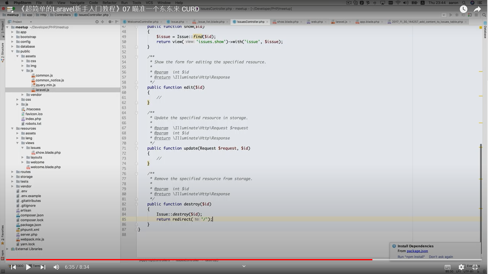
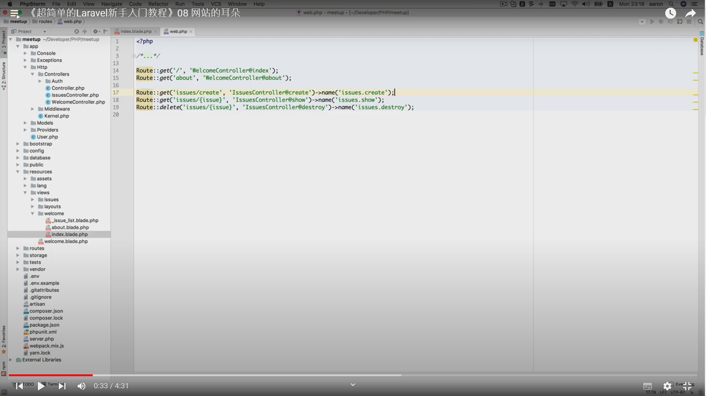
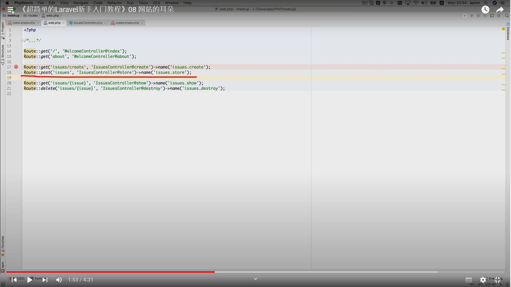
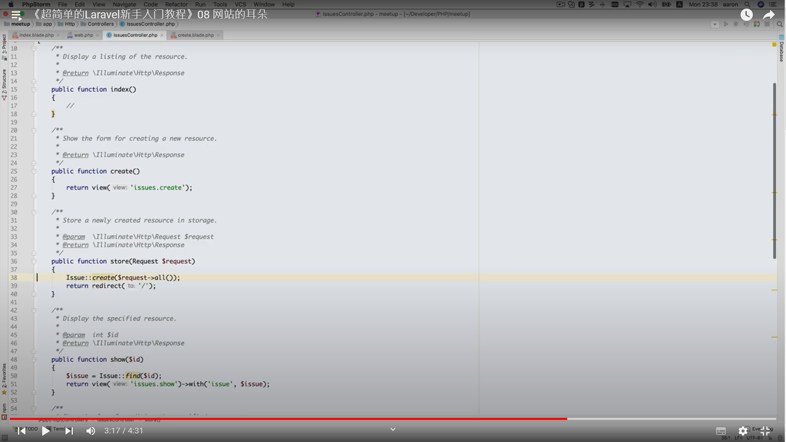

## 超簡單的Laravel新手入門

###  MVC結構




### 笨辦法發消息


### 數據庫

php artisan make:migration create_issues_table --create=issues

php artisan migrate

php artisan make:model Models/Issue

php artisan tinker

use App\Models\Issue

Issue::create(['title'=>'PHP lover'])
Issue::create(['title'=>'Rails and Laravel'])
Issue::all()


開啟操作表

protected $fillable=['title'];


## 07瞄準一個東東來CRUD

php artisan make:migration add_content_to_issues_table --table=issues

$table->text('content');

$table->dropColumn('content');

php artisan migrate

//在tinker中插入數據
php artisan tinker
use App\Models\Issue

$i= Issue::find(1)

$i->content="The PHP Framework For Web Artisans"

$i->save()

$i= Issue::find(2)

$i->content="Image what you could build if you learned Ruby on Rails ..."

$i->save()

//新增Controller
```php
Route::get('issue/{issue}'),'IssuesController@show');
Route::get('issue/{issue}',[IssuesController::class, 'show']);

```


```bash
php artisan make:controller IssuesController -r    //-r代表使用系統預設的7個方法
```


```php
public function show($id)
    {
        return $id;
    }
```



```php
public function show($id)
    {
        $issue = Issue::find($id);
        return $issue;
    }
```

```php
public function show($id)
    {
        $issue = Issue::find($id);
        return view('issues.show')->with('issue',$issue);
    }
```    

修改_issue_list.blade.php

```html
{{-- <a href="issues_show.html" class="">{{$issue['title']}}</a> --}}
                          
{{-- <a href="/issues/{{$issue->id}}" class="">{{$issue->title}}</a> --}}

//改成

<a href="{{route('issue.show',$issue->id)}}" class="">{{$issue->title}}</a>
```

加上刪除功能
```html
<a type="button" class="am-btn am-btn-danger am-radius am-btn-sm">Destroy</a>

改成

<a href="{{route('issue.destory',$issue->id)}}" type="button" class="am-btn am-btn-danger am-radius am-btn-sm">Destroy</a>
```

<script src="/assets/js/laravel.js"></script>



```php
public function destroy($id)
    {
        Issue::destory($id);
        return redirect('/');
    }
```

### 08 網站的耳朵

<a href="issues_create.html" class="am-btn am-btn-default am-btn-secondary">发布新活动</a>
<a href="{{route('issue.create')}}" class="am-btn am-btn-default am-btn-secondary">发布新活动</a>



public function create()
{
return view('issues.create');
}

<form class="am-form" action="{{route('issues.store')}}" method="post">



public function store(Request $request)
{
return $request->all();
}

加上{{csrf_field()}}

