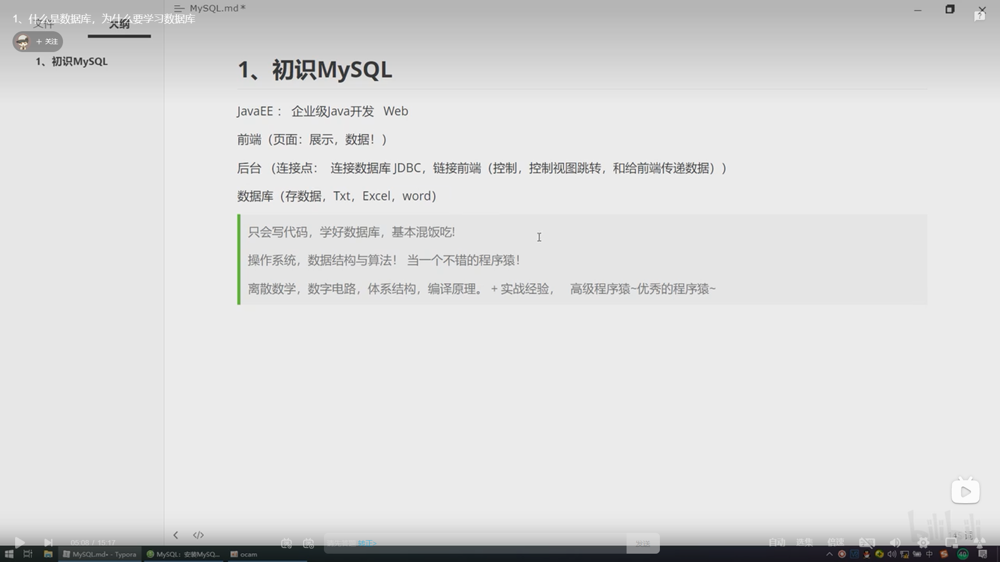
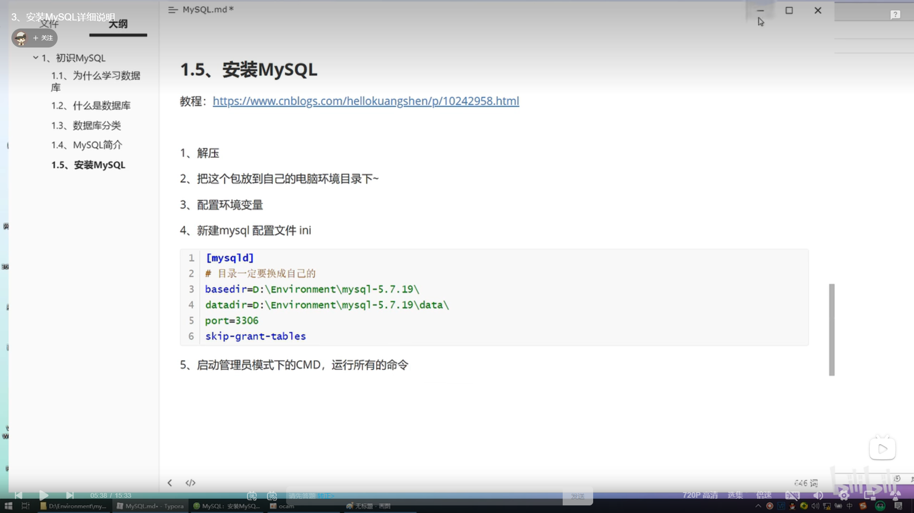
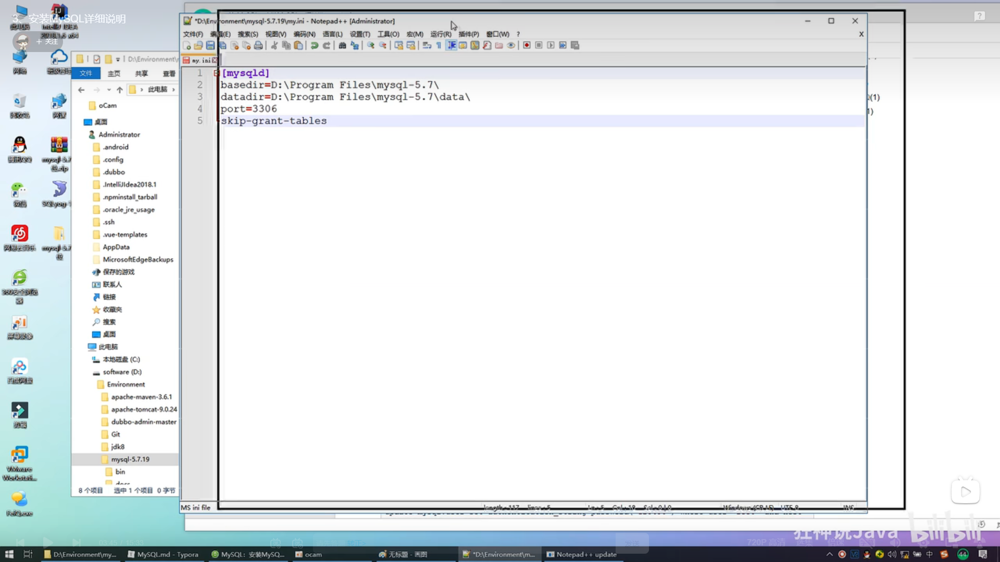
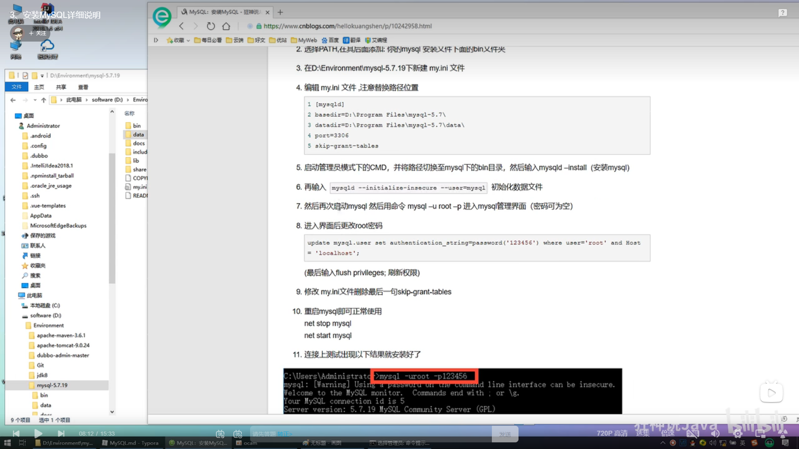
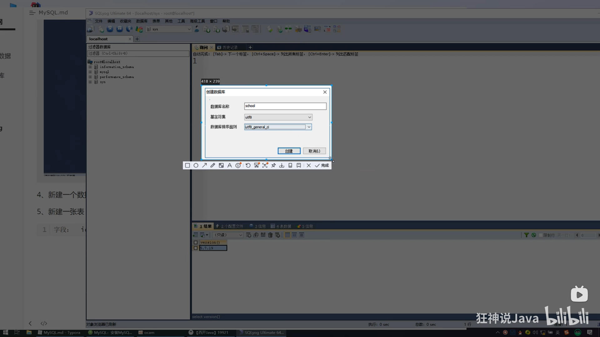

# 初認識 MySQL

JavaEE: 企業級Java開發 Web

前端(頁面:展示，數據!)

後台(連接點: 連接數據庫JDBC , 連接前端(控制，控制視圖跳轉，和給前端傳遞數據))

數據庫(存數據, txt, excel, word)
```text
只會寫代碼，寫好數據庫，基本混飯吃;
操作系統，數據結構與演算法!當一個不錯的程序猿!
離散數學，數字電路，體系結構，編譯原理。+實戰經驗 高級程序猿~優秀的程序猿!

```



### 1.1 為什麼學習數據庫

1.岡位需求
2.現在的世界，大數據時代，得數據者得天下
3.被迫需求: 存數據
== 4.數據庫是所有軟件體系中最核心的存在 ==

### 1.2 什麼是數據庫

數據庫(DB,DataBase)
概念:
作用: 存儲數據，管理數據

1.3 數據庫分類

1.4 MySQL簡介

1.5 安裝mysql




my.ini
basedir=D:\work\Envirment\mysql-8.0.31
datadir=D:\work\Envirment\mysql-8.0.31\data
port=3307
skip-grant-tables


進入mysql(我使用mariadb)
mariadb -u root -p


1.6 安裝SQLyog




# 2.3 數據庫的字段屬性(重點)

__Unsigned:__ 
+ 無符號的整數
+ 聲明該列不能為負數

__Zerofill:__ 
+ 0填充
+  不足的位數，使用0來填充， int(3) , 5 --> 005

__自增 AutoIncrement:__ 
+ 通常理解為自增，自動在上一條紀錄的基礎上+1 (默認)
+ 通常用來設計唯一的主鍵~ index，必須是整數類型
+ 可以自訂義設計主鍵自增的起始值和步長

__非空NOT NULL:__
+ 假設設置為 not null ，如果不給他賦值，就會報錯!
+ NULL ，如果不填寫值，默認就是NULL

__默認:__
+ 設置默認值
+ sex，默認值為男

拓展:

每一個表都必須存在以下五個字段！未來做項目用的，表示一個紀錄存在意義！

id 主鍵
version 樂觀鎖
is_delete 偽刪除
gmt_create 創建時間
gm5_update 更新時間

# (9).創建數據庫表 # 2.4創建數據庫表(重點)
目標 : 創建一個school數據庫
創建學生表(列，字段) 使用SQL創建
學號int 登入密碼varchar(20) 姓名，性別varchar(20)，出生日期(datetime)，家庭住址，email

注意一點 使用英文()，表的名稱和字段盡量使用 \``括號起來
AUTO_INCREMENT 自增
字符串使用單引號括號起來
所有的語句後面加 , (英文的) 最後一個字段不用加
PRIMARY KEY 主鍵，一般一個表只有一個唯一的主鍵
```sql
CREATE TABLE IF NOT EXISTS `product` (
`id` INT(4) NOT NULL AUTO_INCREMENT COMMENT '序號',
`name` VARCHAR(20) NOT NULL DEFAULT '匿名' COMMENT '姓名',
`password` VARCHAR(20) NOT NULL DEFAULT '123456' COMMENT '密碼',
`sex` VARCHAR(2) NOT NULL DEFAULT '女' COMMENT '性別',
`birthday` DATETIME DEFAULT NULL COMMENT '出生日期',
`address` VARCHAR(100) DEFAULT NULL COMMENT '地址',
`email` VARCHAR(50) DEFAULT NULL COMMENT '郵箱',
PRIMARY KEY(`id`)

)ENGINE=INNODB DEFAULT CHARSET=utf8mb3
```

```sql
CREATE TABLE IF NOT EXISTS `student` ( `id` INT(4) NOT NULL AUTO_INCREMENT COMMENT '序號', `name` VARCHAR(20) NOT NULL DEFAULT '匿名' COMMENT '姓名', `password` VARCHAR(20) NOT NULL DEFAULT '123456' COMMENT '密碼', `sex` VARCHAR(2) NOT NULL DEFAULT '女' COMMENT '性別', `birthday` DATETIME DEFAULT NULL COMMENT '出生日期', `address` VARCHAR(100) DEFAULT NULL COMMENT '地址', `email` VARCHAR(50) DEFAULT NULL COMMENT '郵箱', PRIMARY KEY(`id`) )ENGINE=INNODB DEFAULT CHARSET=utf8mb3; 
```


