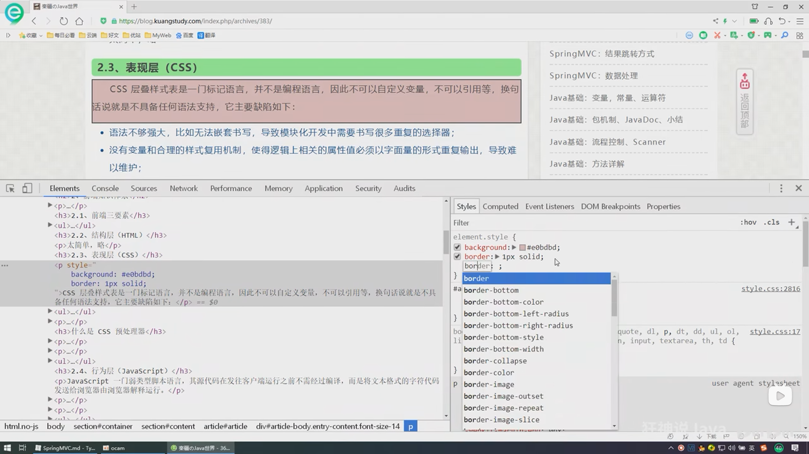

# SSM回顧

# Mybatis

## 判斷

判斷if

## 循環
for循環

# Spring

# SpringMVC

# 進入vue

Vue
Soc:關注點分離原則

HTML+CSS+JS : 視圖 :給用戶看，刷新後台給的數據

網絡通信: axios
頁面跳轉: vue-router
狀態管理: vuex

Vue-UI: ice.work飛冰，

es6瀏覽器不支持，所以需要工具將es6代碼降級為es5
webpack打包工具

像java的maven

M:模型 V:視圖 C:控制器

View: JSP

DATA:

MVVM:數據雙向綁定

虛擬DOM:利用內存

屬性:

