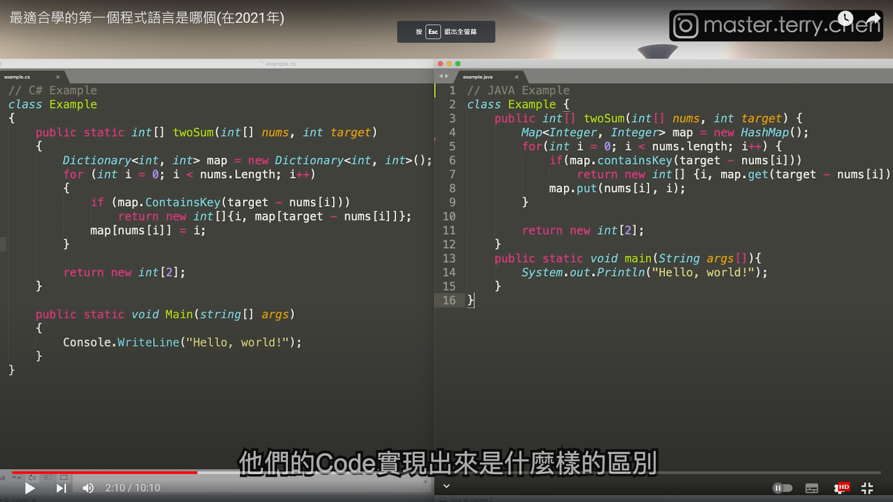

# 常用學習資源

# JAVA
+ [狂神說B站頻道](https://space.bilibili.com/95256449)
+ [狂神說博客1](https://blog.csdn.net/qq_33369905?type=blog)
+ [狂神說博客2](https://www.cnblogs.com/hellokuangshen/)
+ [徐庶的B站頻道](https://space.bilibili.com/1461699434)
+ [許永裕的頻道](https://www.youtube.com/@JavaRoadJava)
+ [Java 程序员](https://www.youtube.com/@javaProgrammer./playlists)
+ [学习学习再学习](https://www.youtube.com/@user-ty6fv7np1y/playlists)

# JavaWeb階段
+ [JSP+Servlet做後台網站](https://www.youtube.com/playlist?list=PLEaNygIz_yw09pCXzShq22LrXYtcV-y0s)

# SpringMVC階段
+ [2天轻松搞定SpringMVC(IDEA版)-最新完整版教程](https://www.youtube.com/playlist?list=PLjwE8m3kyOlcabV5WbL2pgt8zGC--Y9jz)

# SpringBoot階段
+ [【黑马程序员】Java项目实战《瑞吉外卖》，轻松掌握springboot ](https://www.youtube.com/playlist?list=PLFbd8KZNbe-83xyfUZSxleTK-ieWtew3c)
+ [【SpringBoot+Vue商城前后端分离项目】开发完简历可写2年工作经验，不要虚！徐庶老师为你优化简历！](https://www.bilibili.com/video/BV1Y14y1a7JL/?spm_id_from=333.337.search-card.all.click&vd_source=4d97810b203a51648f15ae88a52ea5aa)

# Javascript
+ [ES2015/ES6入门](https://www.youtube.com/playlist?list=PLliocbKHJNwu150Kc7_eEywQBFLTJyPZs)

# Node.js

# Python
+ [【尚硅谷】Python全套教程 2019最适合零基础 提供源码笔记](https://www.youtube.com/playlist?list=PLmOn9nNkQxJFGvtKd7PI7AhsYmY-6FrJs)
+ [【黑马程序员】Python零基础从入门到精通全套教程，学python看這套就夠了](https://www.youtube.com/playlist?list=PLFbd8KZNbe-_6HJzJ3RgYIOZ4mbJWOSo4)
+ 

# PHP 
+ 我的php啟蒙教學
+ [PHP Tutorial for Absolute Beginners - PHP Course 2021](https://www.youtube.com/watch?v=yXzWfZ4N4xU)
+ [從零開始學Vue 3](https://www.youtube.com/playlist?list=PLL26U2k-yzXudMxjopJ9TnIeHR0a0ZjNj)
+ [從零開始學Laravel 8](https://www.youtube.com/playlist?list=PLL26U2k-yzXtUSppbrYKYYiGDP2kHOaUC)

+ [TheCodeholic](https://www.youtube.com/@TheCodeholic/videos)
+ [Big Boy Can Code](https://www.youtube.com/@BigBoyCanCode/videos)
+ [為你自己學 Laravel](https://www.youtube.com/playlist?list=PLBd8JGCAcUAFtnWuuqd0tzMwYsVAN4es_)
+ [超简单的Laravel新手入门教程](https://www.youtube.com/playlist?list=PLMBDhv7_hEqQi5g25ice0_ESlJUcRrNph)
+ [Laravel技巧库](https://www.youtube.com/playlist?list=PLMBDhv7_hEqS5P2nnVaG2zDN-Zl91w-UX)

+有時間來做練習
+ [轻松学会Laravel-项目篇（商城API） 【API开发#接口开发规范项目】服务器端标准的接](https://www.bilibili.com/video/BV1Fp4y1b7eo/?spm_id_from=333.337.search-card.all.click&vd_source=4d97810b203a51648f15ae88a52ea5aa)
+ [laravel8+vue-element-admin+nuxt构建CMS管理系统【咪乐多CMS管理系统】](https://www.bilibili.com/video/BV1xL411W7DE/?spm_id_from=333.337.search-card.all.click&vd_source=4d97810b203a51648f15ae88a52ea5aahttps://www.bilibili.com/video/BV1Fp4y1b7eo/?spm_id_from=333.337.search-card.all.click&vd_source=4d97810b203a51648f15ae88a52ea5aa)

# 前端

# Vue

# React

# Angular
+ [Angular 入門教學](https://www.youtube.com/playlist?list=PLneJIGUTIItu6QrNxEBAUgTXZaHIpO8D9)

# 正則表達式 Regular Expression
+ [Regular Expression - 正则表达式](https://www.youtube.com/playlist?list=PLjwE8m3kyOle-wKE_yLFQMGrGskyHIMmZ)

# MarkDown
+ [Markdown入门](https://www.youtube.com/playlist?list=PLliocbKHJNwvnlL9xkwhdkaqmPbI9LU0m)

# C# DotNet家族
+ [凱哥寫程式](https://www.youtube.com/@TalllKaiCoding/playlists)

# 多種技術

+ [The Net Ninja](https://www.youtube.com/@NetNinja)
+ [Traversy Media](https://www.youtube.com/@TraversyMedia/videos)
+ [GrandmaCan -我阿嬤都會](https://www.youtube.com/@GrandmaCan)
+ [Bro Code](https://www.youtube.com/@BroCodez)
+ [小马技术](https://www.youtube.com/@deeplearncloud/featured)
+ [Gamma Ray 軟體工作室](https://www.youtube.com/@rhxs020)
+ [程序员小飞](https://www.youtube.com/@user-dp9cs2dp1w/featured)
+ [黑马程序员](https://www.youtube.com/@itheima666)
+ [尚硅谷IT培训学校](https://www.youtube.com/@atguigu/featured)
+ [千锋教育](https://www.youtube.com/@user-wm4iq2er7y)
+ [SchelleyYuki](https://www.youtube.com/@schelley)
+ [freeCodeCamp.org](https://www.youtube.com/@freecodecamp)

# 技術閒聊
+ [HackBear 泰瑞](https://www.youtube.com/@hackbearterry)
+ 
+ [走歪的工程師James](https://www.youtube.com/@atypical-dev/videos)
+ [在地上滾的工程師 Nic](https://www.youtube.com/@niclin)

# 資料結構
+ [80分鐘搞懂資料結構](https://www.youtube.com/playlist?list=PLhxdaTcUMi3lzWuIuZw05Y77qtGeK_Gan)
+ [你知道...軟體工程師面試, 都考什麼資料結構嗎？轉職自學新手請看!](https://www.youtube.com/watch?v=EmszsWg50ts&ab_channel=Untyped%E5%B0%8D%E5%95%8A%E6%88%91%E6%98%AF%E5%B7%A5%E7%A8%8B%E5%B8%AB)

# 演算法

# 花錢錢買了的Udemy課程
+ [Python 3零基础完全入门与提高（面向2022, Python3.8/3.9,不断更新ing）](https://www.udemy.com/course/python3-chinese/)
+ [The Complete 2023 Web Development Bootcamp](https://www.udemy.com/course/the-complete-web-development-bootcamp/)

# 要錢的教學網站

+ [Udemy](https://www.udemy.com/)
+ [howhow好學校](https://hahow.in/)
+ [coursera](https://www.coursera.org/)
+ [codecademy](https://www.codecademy.com/)
+ [Happy Coding 快樂學程式](https://www.udemy.com/user/happycoding2/)

# 不要錢的教學網站
+ [freecodecamp](https://www.freecodecamp.org/)
 

