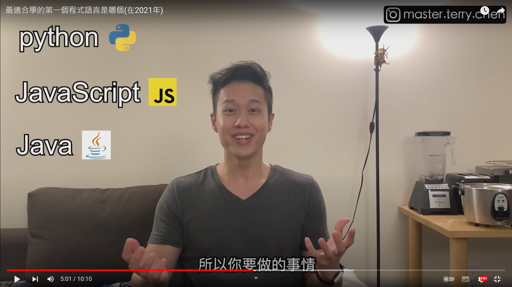

# 學什麼程式語言?

## 最適合學的第一個程式語言是哪個(在2021年)

+ [最適合學的第一個程式語言是哪個(在2021年)](https://www.youtube.com/watch?v=3EkaxkNGXD8&ab_channel=HackBear%E6%B3%B0%E7%91%9E)

## 2022最適合學的程式語言

+ [2022最適合學的程式語言](https://www.youtube.com/watch?v=pSoDUFdqVOU&ab_channel=HackBear%E6%B3%B0%E7%91%9E)

## 程序员小姐姐: 编程入门该学哪门语言? Java? Python? JavaScript? 如何加强编程基本功? | 编程语言

+ [程序员小姐姐: 编程入门该学哪门语言? Java? Python? JavaScript? 如何加强编程基本功? | 编程语言](https://www.youtube.com/watch?v=6B9Olpve4n0&t=758s&ab_channel=SchelleyYuki)

# 如何自學

+ [一起養成工程師腦！5個線上自學工具分享！工程師毛巾【工程師#2 】](https://www.youtube.com/watch?v=c1BRTvaaD3U&ab_channel=%E7%A7%91%E6%8A%80%E6%97%85%E4%BA%BA%E6%AF%9B%E5%B7%BEVincent)
+ [快速找到適合你的程式語言! 最有效的自學方式? 英文能力重要嗎? 百萬年薪真的嗎? | 軟體開發 | 程式語言入門 | 轉職 | 工程師 Nic](https://www.youtube.com/watch?v=E7T1jr1lnQM&ab_channel=%E5%9C%A8%E5%9C%B0%E4%B8%8A%E6%BB%BE%E7%9A%84%E5%B7%A5%E7%A8%8B%E5%B8%ABNic)
+ [想轉職軟體工程師? 10個必知自學資源！外商面試題目大公開](https://www.youtube.com/watch?v=N4Vhlf6pYfM&ab_channel=%E7%A7%91%E6%8A%80%E4%BA%BA%E8%94%98TechLife)

# RoadMap

## 前端工程師 frontend RoadMap

+ [frontend RoadMap](https://roadmap.sh/frontend)

## 後端工程師 backend RoadMap

+ [backend RoadMap](https://roadmap.sh/backend)

## 初學者學習 RoadMap

## Java工程師 RoadMap

[Java RoadMap](https://roadmap.sh/java)

## How To Master Java - Java for Beginners Roadmap

[Link](https://www.youtube.com/watch?v=TE3LyYW-AHQ&ab_channel=Amigoscode)

## php工程師 RoadMap

## JavaScript RoadMap
[JavaScript RoadMap](https://roadmap.sh/javascript)

## angular RoadMap
[angular RoadMap](https://roadmap.sh/angular)

## Vue Developer
[Vue Developer](https://roadmap.sh/vue)

## Python Developer
[Python Developer](https://roadmap.sh/python)

